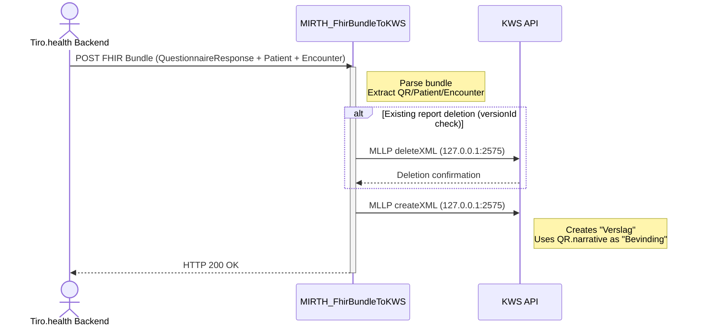
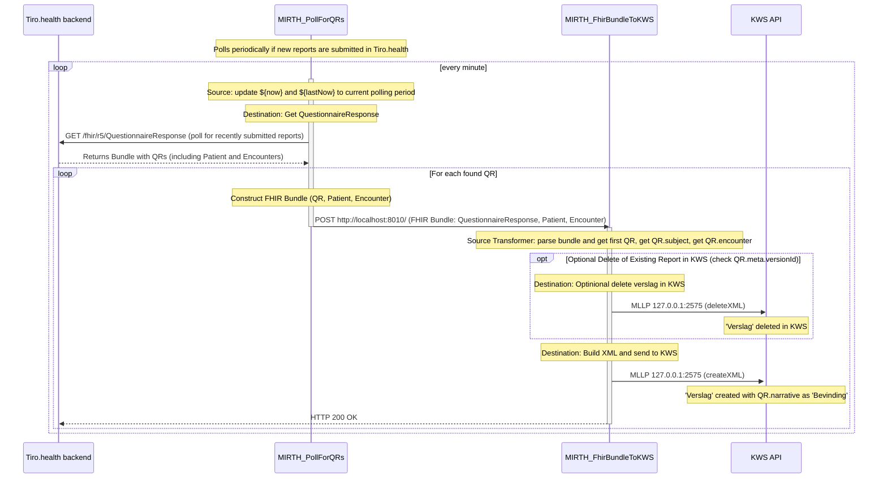

# FhirBundleToKWS

This sample demonstrates how to export reports to KWS. The channel listens for a FHIR bundle, then parses, transforms, and sends it to KWS.

Before importing, ensure you replace all 'FILL ME' placeholders in the `FHIRBundleToKWS.xml` file with the appropriate values, please contact [support@tiro.health](mailto:support@tiro.health) for more information.

## Configuration
This channel works with a Configuration Map (`Settings` → `Configuration Map` tab). The following keys are expected:

| Key                 | Description                                                                 |
|---------------------|-----------------------------------------------------------------------------|
| `tiroKwsAppNaam`    | Application name identifier (Contact Nexushealth)                           |
| `tiroKwsZiekenhuis` | Hospital identifier (Contact Nexushealth)                                   |
| `tiroUsername`      | Authentication username (Contact [support@tiro.health](mailto:support@tiro.health)) |
| `tiroPassword`      | Authentication password (Contact [support@tiro.health](mailto:support@tiro.health)) |

## Test Procedure
1. Run both `mock_kws` and `FhirBundleToKWS` channels
2. In the dashboard, right-click `FhirBundleToKWS` → `Send Message`
3. Click 'Open Text File', select `test_bundle_kws_import.json` and click 'Process Message'
4. Check server logs for generated XML output

## Data Mapping
| Element               | Source                                                                                                |
|-----------------------|-------------------------------------------------------------------------------------------------------|
| eadnr/cnr/externId    | Extracted from `Patient`, `Encounter`, and `QuestionnaireResponse` identifiers                        |
| Verslag text          | Taken from `QuestionnaireResponse.narrative`                                                          |
| Supervisor            | Mapped from `Encounter.participant` field                                                             |
| Arts                  | Not included (assumes pre-existing KWS contact)                                                       |
| Verslag deletion      | Triggered when `QuestionnaireResponse.meta.versionId` indicates a deleted version                     |

---

## Sequence Diagram (Direct Mode)

## Sequence Diagram (With Polling)
Instead of a transaction from Tiro.health, you could poll Tiro.health for a QuestionnaireResponse and transform it in to a transaction. The advantage of this approach is that we don't need to setup a VPN to bypass the firewall (the request comes from the hospital). The disadvantage is that the report will not instantly be visible in KWS.

