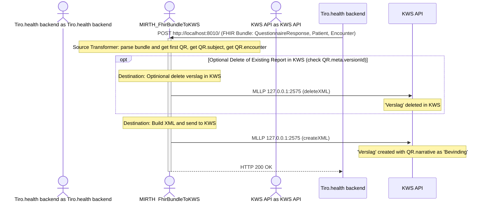

# FhirBundleToKWS

This sample demonstrates how to export reports to KWS.

This channel listens for a FHIR bundle which is then parsed, transformed and sent to KWS.

Before importing, ensure you replace all 'FILL ME' placeholders in the `PollFOrQRs.xml` file with the appropriate values. For the necessary credentials, please contact [support@tiro.health](mailto:support@tiro.health).

## Mapping
    - eadnr, cnr, verslag externId: extracted from the identifiers of the Patient, Encounter, and QuestionnaireResponse resources.
    - Verslag text: taken from the narrative of the QuestionnaireResponse.
    - Supervisor: extracted from the participant field of the Encounter.
    - Arts: not included, as the contact should already exist in KWS according to the intended flow. If needed, it can be mapped similarly to the supervisor.
    - Verslag deletion: the versionId of the QuestionnaireResponse is checked to determine if the report should be deleted in KWS first.


## Sample trigger message
```bash
curl --location 'http://localhost:8010' \
--header 'Content-Type: application/json' \
--data '{
  "resourceType": "Bundle",
  "type": "transaction",
  "entry": [
    {
      "fullUrl": "urn:uuid:3302b6e2-286c-505d-988d-14a7234a8754",
      "request": {
        "url": "Patient?identifier=http://tiro.health/Patient%7C1",
        "method": "PUT"
      },
      "resource": {
        "resourceType": "Patient",
        "id": "1",
        "identifier": [
          {
            "system": "https://fhir.nexuzhealth.com/standards/fhir/NamingSystem/kws/pm/patient/eadnr",
            "value": "12345678901"
          }
        ],
        "birthDate": "1980-01-01",
        "gender": "male",
        "name": [
          {
            "prefix": [],
            "given": [
              "John"
            ],
            "family": "Doe",
            "text": "John Doe"
          }
        ]
      }
    },
    {
      "fullUrl": "urn:uuid:5302b6e2-286c-505d-988d-14a7234a8754",
      "request": {
        "url": "Encounter?identifier=http://tiro.health/Encounter%7C1",
        "method": "PUT"
      },
      "resource": {
        "resourceType": "Encounter",
        "identifier": [
          {
            "system": "https://fhir.nexuzhealth.com/standards/fhir/NamingSystem/kws/bifrost/receptie/cnr",
            "value": "123"
          }
        ],
        "participant": [
          {
            "type": [
              {
                "coding": [
                  {
                    "system": "http://terminology.hl7.org/CodeSystem/v3-ParticipationType",
                    "code": "RESP",
                    "display": "Primary Performer"
                  }
                ]
              }
            ],
            "actor": {
              "identifier": {
                "system": "https://tiro.health/standards/fhir/NamingSystem/kws/user-id",
                "value": "kws_supervisor"
              }
            }
          }
        ],
        "subject": {
          "type": "Patient",
          "reference": "urn:uuid:e10a3ee5-8c28-5205-998f-ae74e4d8417a"
        },
        "status": "completed"
      }
    },
    {
      "fullUrl": "urn:uuid:b020fab6-a998-5a5b-9cf0-713c4dd55dcf",
      "request": {
        "url": "QuestionnaireResponse",
        "method": "POST"
      },
      "resource": {
        "id": "1",
        "meta": {
          "extension": [
            {
              "url": "http://hl7.org/fhir/StructureDefinition/firstCreated",
              "valueInstant": "2021-01-01T00:00:00Z"
            }
          ],
          "lastUpdated": "2021-01-01T00:00:00Z",
          "versionId": "1"
        },
        "identifier": [
          {
            "system": "http://tiro.health/fhir/NamingSystem/report-id",
            "value": "1"
          }
        ],
        "questionnaire": "http://templates.tiro.health/templates/test1%7C1.0.0",
        "encounter": {
          "type": "Encounter",
          "reference": "urn:uuid:5302b6e2-286c-505d-988d-14a7234a8754"
        },
        "status": "in-progress",
        "text": {
          "status": "generated",
          "div": "<div xmlns=\"http://www.w3.org/1999/xhtml\">\n   <pre>\n      Comorbidity? YES\n       Cardial Comorbidity? YES\n        Angina? YES\n        MI? NO\n       Vascular Comorbidity?\n        (no answers)\n       ...\n      Histopathology\n       Abdominal\n        pT category: 1a\n       ...\n     </pre>\n  </div>",
          "extension": [
            {
              "url": "http://fhir.tiro.health/StructureDefinition/narrative-alternative-format",
              "valueAttachment": {
                "contentType": "text/plain",
                "data": "VHVtb3Igc2l6ZTogMy4wIA=="
              }
            }
          ]
        },
        "item": [
          {
            "text": "MRI Brain",
            "linkId": "1",
            "item": [
              {
                "text": "Tumor size",
                "linkId": "2",
                "answer": [
                  {
                    "valueDecimal": "1.0"
                  }
                ]
              }
            ]
          }
        ],
        "resourceType": "QuestionnaireResponse",
        "subject": {
          "type": "Patient",
          "reference": "urn:uuid:3302b6e2-286c-505d-988d-14a7234a8754"
        },
        "author": {
          "type": "Practitioner",
          "reference": "urn:uuid:e10a3ee5-8c28-5205-998f-ae74e4d8417a"
        }
      }
    }
  ]
}'
```

## Sequence Diagram


# With Polling
Instead of a transaction from Tiro.health, you could poll Tiro.health for a QuestionnaireResponse and transform it in to a transaction. The advantage of this approach is that we don't need to setup a VPN to bypass the firewall (the request comes from the hospital). The disadvantage is that the report will not instantly be visible in KWS.

## Sequence Diagram
With channel PollForQRs.xml it looks like this:

