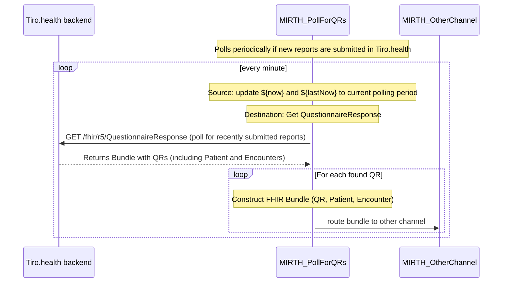

# Polling for QuestionnaireResponses in Tiro.health

This sample demonstrates how to poll for any reports that have been submitted in Tiro.health. The data in the reports are stored as FHIR QuestionnaireResponses, which are linked to Patients and Encounters. The channel retrieves these QuestionnaireResponses and routes them to another channel for further processing.

### Why Polling for QuestionnaireResponses?
Polling for QuestionnaireResponses is useful in networks where incoming requests from external systems are not possible or not desired. By periodically checking for new reports, the channel can ensure that all submitted reports are processed and routed to the appropriate channels for further action.

### How it Works
This channel polls every minute and does a FHIR search query to get all QRs that are completed in the current polling interval: 
<code>GET /fhir/r5/QuestionnaireResponse?_lastUpdated=ge[X]&status=completed&_include=subject&_include=encounter</code>

For every QuestionnaireResponse that was found, we create a collection bundle with the QuestionnaireResponse, Patient and Encounter and route it to another channel.

Before importing, ensure you replace all 'FILL ME' placeholders in the `PollFOrQRs.xml` file with the appropriate values. For the necessary credentials, please contact [support@tiro.health](mailto:support@tiro.health).

## Sequence Diagram

