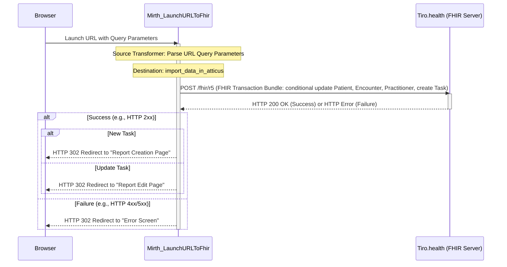

# Parametrized URL to FHIR Transaction:

This sample demonstrates how to transform a parametrized URL into a FHIR transaction that imports data into Atticus. The channel monitors GETs to [http://localhost:80/launch](http://localhost/launch/) and sends a POST request to the [Atticus Transaction API](https://docs.tiro.health/fhir/Transaction). If the POST is a success, the browser is redirected to the Atticus home page. If not, the browser is redirected to an error screen.

### Why converting a HTTP GET request into a HTTP POST request in a Mirth channel?
A lot of healthcare systems allow for configuration of parametrized URLs. Resolving those URLs on external servers is not always desirable because it can lead to security issues, such as exposing sensitive data in the URL or allowing unauthorized access to the system. Therefore, it is often better to resolve these URLs on the server side, where you can control the data and ensure that it is handled securely.

## Configuration
This channel works with a Configuration Map (`Settings` → `Configuration Map` tab). The following keys are expected:

| Key                 | Description                                                                 |
|---------------------|-----------------------------------------------------------------------------|
| `tiroUsername`      | Authentication username |
| `tiroPassword`      | Authentication password |

Please contact [support@tiro.health](mailto:support@tiro.health) for these credentials.

## Sequence diagram

## Custom Mappings
In the source transformer you can map URL query parameters to import fields in Atticus. Currently, some custom mappings are configured for Nexuzhealth KWS, for example:
[http://localhost/launch/?encounter=test-cnr3&dob=1941-12-12&sex=male&patient=test-ead3&user=andrieskwslogin](http://localhost/launch/?encounter=test-cnr3&dob=1941-12-12&sex=male&patient=test-ead3&user=andrieskwslogin).
