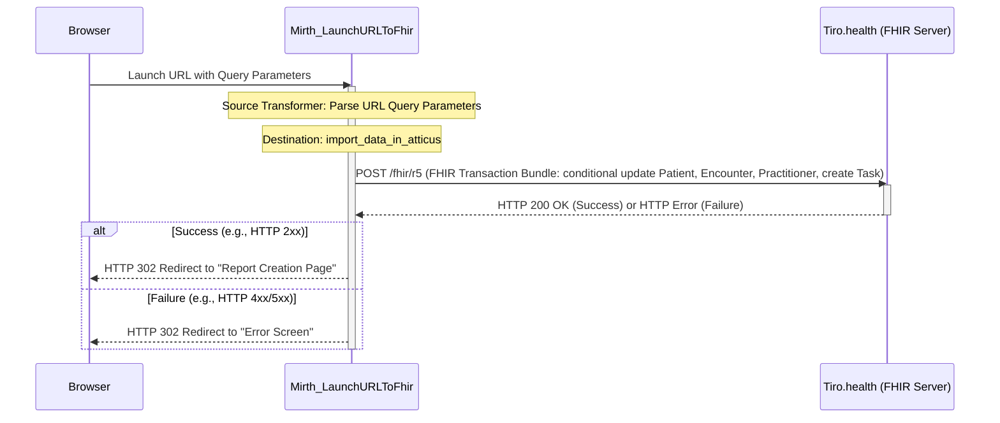

# URL to FHIR Transaction

This sample demonstrates how to transform a URL into a FHIR transaction and import it into Atticus. The channel monitors GETs to [http://localhost:80/launch](http://localhost/launch/) and sends a POST request to the [Atticus Transaction API](https://docs.tiro.health/fhir/Transaction). If the POST is a success, the browser is redirected to the Atticus home page. If not, the browser is redirected to an error screen.

Before importing, ensure you replace all 'FILL ME' placeholders in the `LaunchURLToFhir.xml` file with the appropriate values. For the necessary credentials, please contact [support@tiro.health](mailto:support@tiro.health).

## Sequence diagram

## Custom Mappings
In the source transformer you can map URL query parameters to import fields in Atticus. Currently, some custom mappings are configured for KWS, for example:
[http://localhost/launch/?encounter=test-cnr3&dob=1941-12-12&sex=male&patient=test-ead3&user=andrieskwslogin](http://localhost/launch/?encounter=test-cnr3&dob=1941-12-12&sex=male&patient=test-ead3&user=andrieskwslogin).

